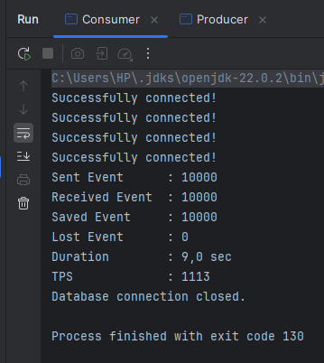

# High-Throughput Kafka + MySQL Demo

## Yêu cầu
- Java 22+, Maven 3.x, Docker Desktop

## Các bước chạy

**1. Build project**
```bat
mvn clean package -DskipTests
```

**2. Khởi động Docker (Kafka + MySQL)**
```bat
docker compose -f src/main/docker/docker-compose.yml up -d
```

**3. Chạy Consumer** (chờ ~30s để Kafka/MySQL sẵn sàng)
```bat
java -cp target/producer2-1.0-SNAPSHOT-jar-with-dependencies.jar org.example.Consumer
```

**4. Chạy Producer** (mở terminal mới)
```bat
java -cp target/producer2-1.0-SNAPSHOT-jar-with-dependencies.jar org.example.Producer
```

## Kết quả



## Cấu trúc dự án

```
producer2/
├── Makefile
├── pom.xml
└── src/main/
    ├── docker/
    │   ├── docker-compose.yml   # Kafka (KRaft) + MySQL + tạo topic
    │   └── init.sql             # Khởi tạo bảng messages
    ├── java/org/example/
    │   ├── Producer.java
    │   ├── Consumer.java
    │   ├── Main.java
    │   ├── Message.java
    │   ├── database/DatabaseConnection.java
    │   └── serializer/
    └── resources/
        └── simplelogger.properties
```
